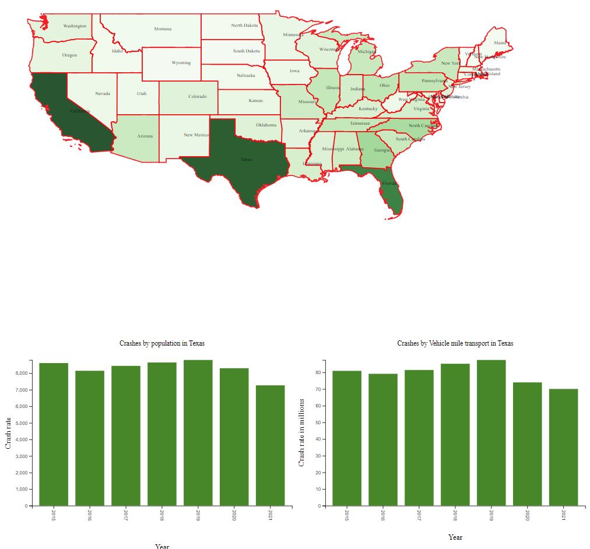
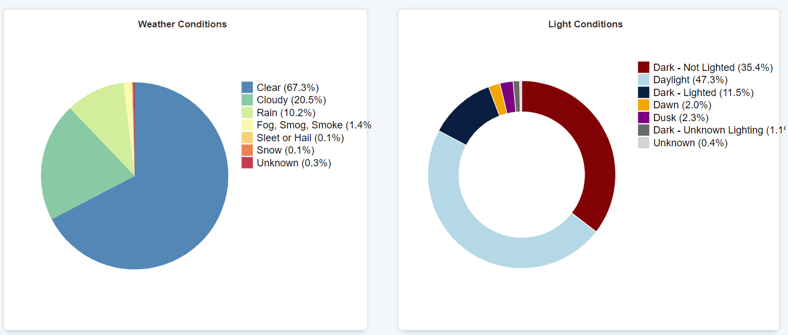
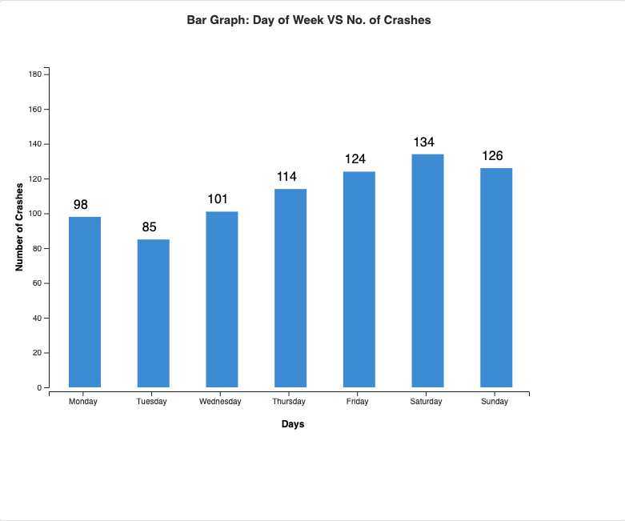
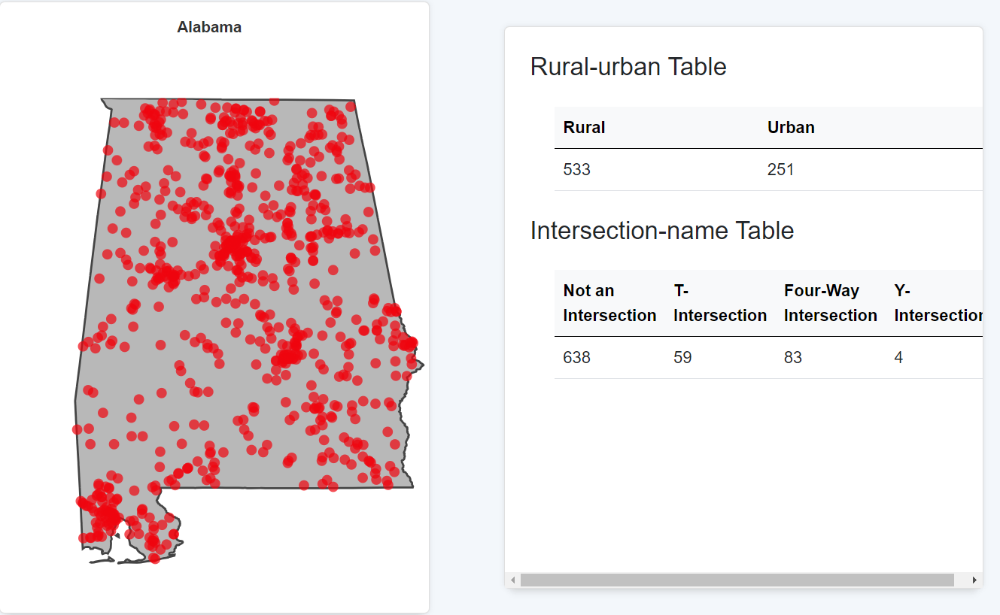

# Fatal Crashes in the United States (2015-2021)

## Overview
This project visualizes fatal crash data in the United States from 2015 to 2021, aiming to identify crash hotspots, contributing factors, and their variations across states and years. By leveraging **D3.js**, the project integrates multiple datasets to generate interactive and informative visualizations for analyzing crash trends.

The analysis includes datasets for crash details, state population statistics, and vehicle miles traveled (VMT). The visualizations help uncover patterns related to factors like weather, light conditions, time of day, and spatial crash clustering, enabling policymakers to prioritize safety improvements effectively.

---

## Visualization Techniques
A variety of visualizations were employed in this project to analyze crash data:

1. **Spatial Maps**:
   - **Purpose**: Display the total number of fatal crashes per state.
   - **Details**: States are color-coded by crash density (darker colors indicate more crashes).
   - **Screenshot**:  
     

2. **Bar Charts**:
   - **Purpose**: Show variation in crashes over time (per population and per million VMT).
   - **Details**: 
     - Bar charts display temporal trends for each state.
     - Population-adjusted and VMT-adjusted crash rates are compared.

3. **Donut and Pie Charts**:
   - **Purpose**: Visualize variable-specific trends such as light and weather conditions during crashes.
   - **Details**:
     - **Donut Charts**: Proportion of crashes under different lighting conditions.
     - **Pie Charts**: Proportion of crashes under various weather conditions.
   - **Screenshot**:  
       

4. **Column Charts**:
   - **Purpose**: Analyze crash distribution by the day of the week.
   - **Details**: Highlights weekdays vs. weekends and identifies the most frequent crash days.
   - **Screenshot**:  
     

5. **Cycle Plots**:
   - **Purpose**: Show monthly crash patterns for each state from 2015 to 2021.
   - **Details**: Visualize seasonal trends and improvements in crash rates over time.
   - **Screenshot**:  
     

6. **Cluster Maps**:
   - **Purpose**: Display crash hotspots within a selected state and year.
   - **Details**: High-density points on the map indicate potential crash hotspots.
   - **Screenshot**:  
     

---

## Key Insights
- **Statewide Trends**:
  - Higher crash rates are observed in states like California and Texas.
  - Crash rates correlate with population density and VMT.
- **Temporal Trends**:
  - Crash rates per population and per million VMT have shown improvement over time.
- **Variable-Specific Trends**:
  - Adverse weather and poor lighting conditions significantly impact crash occurrences.
  - Weekends and late-night hours show higher crash frequencies.
- **Hotspot Identification**:
  - High-density crash clusters are identified for targeted safety interventions.

---

This project demonstrates the power of visualization in analyzing complex crash datasets, offering actionable insights for improving road safety across the United States.
